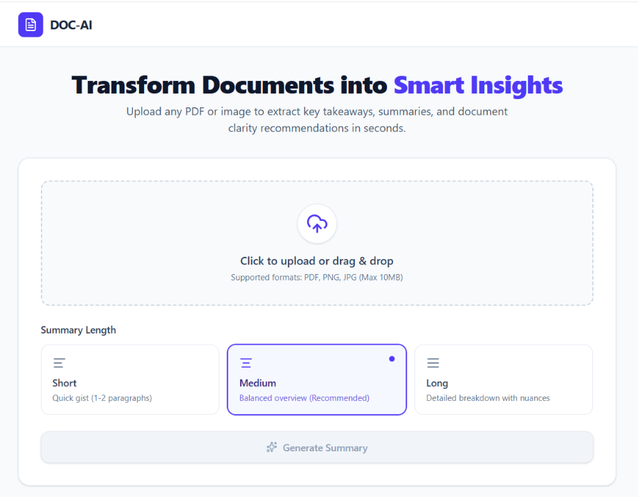

# DOC-AI - Document Summary Assistant

DOC-AI is a privacy-first, full-stack application that helps users turn complex PDFs and scanned documents into clear, structured summaries.

Designed with scalability and data security in mind, the application processes documents directly on the edge (client-side) before securely routing the extracted data to an advanced Large Language Model for summarization and analysis.

## Live Demo

- **Frontend (Vercel):** https://doc-ai-coral.vercel.app/
- **Backend (Render):** https://doc-ai-xlpd.onrender.com

## Application UI


_Caption: The main upload interface for DOC-AI._


_Caption: Structured insights, key points, and actionable suggestions._

## Features

- **Privacy-First Parsing:** Documents (PDFs and Images) are parsed locally in the browser; raw files are never stored on external servers.
- **Smart Summarization:** Users can toggle between short, medium, and long summary lengths.
- **Structured Insights:** Output includes a core summary, actionable key points, and document improvement suggestions.
- **Native Export:** Built-in capabilities to copy the structured output to the clipboard or download it as a formatted Markdown (`.md`) file.
- **Responsive UI:** Built with Tailwind CSS to ensure a seamless experience across desktop and mobile viewports.

## Architecture: The Edge-Processing Shift

DOC-AI utilizes a highly optimized client-server architecture designed to eliminate server-side bottlenecks and protect user privacy.

Instead of uploading bulky PDFs or images directly to a backend server—which risks memory exhaustion and compromises sensitive data—**all text extraction and image encoding occurs entirely client-side.**

1.  **Frontend Extraction:** When a user uploads a document, the React frontend uses the browser's native capabilities and `pdfjs-dist` to extract text from PDFs or convert images to Base64 strings locally.
2.  **Lightweight Transmission:** The frontend acts as a "smart client," sending only a lightweight JSON payload to the backend.
3.  **Stateless Routing:** The FastAPI backend functions purely as a highly concurrent routing layer. It does not store or process files, meaning it can scale to thousands of users with a near-zero memory footprint.
4.  **AI Analysis:** LangChain routes the text or Base64 image to Groq's Llama models (70B for text, 11B Vision for images) using a strict system prompt.
5.  **Schema Validation:** The response is strictly validated using Pydantic via LangChain's `JsonOutputParser` to ensure no dropped fields before returning to the UI.

```text
Document Upload
       │
       ▼
React Frontend
       │
       ▼
Text Extraction / OCR
       │
       ▼
FastAPI Backend
       │
       ▼
LangChain
       │
       ▼
Groq Llama Model
       │
       ▼
Pydantic Validation
       │
       ▼
Summary, Key Points & Suggestions
```

## Engineering & Reliability

- **Error Handling:** Features graceful UI alerts for client-side issues and strict FastAPI exception handlers for clean, actionable HTTP responses.
- **Resilient AI Pipelines:** Utilizes regex fallbacks and LangChain's structured output parsers to guarantee exact JSON schema compliance and prevent hallucinated formatting.
- **Code Quality:** Heavily leverages Pydantic for data validation within a modular, cleanly separated client-server architecture.

## Tech Stack

### Frontend

- React
- Vite
- Tailwind CSS
- pdfjs-dist
- Lucide React

### Backend

- Python
- FastAPI
- Uvicorn
- Pydantic

### AI & Document Processing

- LangChain
- Groq API
- Llama Models
- PyMuPDF
- Models: GPT OSS 20B (Text), qwen3.6-27b (Images)

## Project Structure

```text
doc-ai/
├── backend/
│   ├── app/
│   │   ├── api/
│   │   ├── models/
│   │   ├── services/
│   │   └── main.py
│   ├── .env
│   └── requirements.txt
│
├── frontend/
│   ├── src/
│   ├── public/
│   └── package.json
│
├── .gitignore
└── README.md

```
